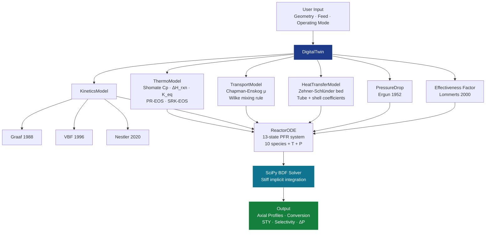

<div align="center">

# 🏭 Methanol Synthesis Reactor Digital Twin

### *A simulation platform for industrial Cu/ZnO/Al₂O₃ methanol synthesis reactor*

[](https://www.python.org/downloads/)
[](LICENSE)
[]()
[]()
[](https://numpy.org/)

**Three published kinetics · PR/SRK fugacity · Cooled/isothermal/adiabatic modes · Validated against 114 experimental data points**

[Quickstart](#-quickstart) · [Theory](#-theoretical-background) · [Validation](#-validation) · [Architecture](#-architecture) · [References](#-references)

</div>

---

## 📋 Overview

This repository implements a **physically-rigorous, one-dimensional, pseudo-homogeneous plug-flow reactor (PFR) digital twin** for industrial multi-tubular methanol synthesis on Cu/ZnO/Al₂O₃ catalysts of the Lurgi MRP type. The model integrates Langmuir-Hinshelwood-Hougen-Watson (LHHW) kinetics, Peng-Robinson and Soave-Redlich-Kwong fugacity corrections, Ergun-type pressure drop, Zehner-Schlünder pellet-scale transport, and a coupled 1-D energy balance with finite tube-to-shell heat transfer.

The platform is intended for:

* 🔬 **Research** - operating-window scans, kinetics intercomparison, sensitivity analysis, dynamic transient studies
* ⚙️ **Industrial first-pass design** - reactor sizing, GHSV optimization, hot-spot location prediction
* 🚀 **Digital-twin prototyping** - building block for real-time monitoring and model-predictive control

---

## ✨ Key Features

<table>
<tr><td>

**🧪 Three published kinetic models**
Graaf (1988), VBF (1996), Nestler (2020) - selectable at runtime, all driving toward the same Graaf-Winkelman (2016) thermodynamic equilibrium.

</td><td>

**🌡️ Three thermal modes**
Cooled (Lurgi MRP polytropic), isothermal (limit case), adiabatic (worst-case hot-spot study) - with full energy balance.

</td></tr>
<tr><td>

**💨 Real-gas thermodynamics**
Peng-Robinson EOS for VBF/Graaf, Soave-Redlich-Kwong for Nestler - fugacity coefficients computed at every solver step.

</td><td>

**📐 Industrial-scale geometry**
7 m × 38 mm × 5,000 tubes default (≈5,000 t/day plant); fully parametric for sizing studies.

</td></tr>
<tr><td>

**📊 GHSV operating window scan**
9-panel comparative figure showing throughput, conversion, STY, and ΔP across 2,000-50,000 h⁻¹.

</td><td>

**✅ Validated**
114 experimental data points from Park et al. (2014), spanning 220-340 °C, 50-90 bar, GHSV 9k-45k h⁻¹.

</td></tr>
</table>

---

## 🚀 Quickstart

### Installation

```bash
git clone https://github.com/neelaugustineprocessengineer/Methanol-Synthesis-Reactor-Digital-Twin.git
cd Methanol-Synthesis-Reactor-Digital-Twin
pip install -r requirements.txt
```

### Run an industrial-scale simulation

```bash
python methanol_digital_twin.py
```

The interactive prompt will ask for geometry, operating conditions, and which kinetic model to use. Default values reproduce a Lurgi MRP world-scale plant at 240 °C, 75 bar, GHSV = 10,000 h⁻¹.

### Programmatic example

```python
import numpy as np
from methanol_digital_twin_2 import DigitalTwin

# Industrial Lurgi MRP geometry
reactor = {
    'L': 7.0, 'd_t': 0.038, 'N_tubes': 5000,
    'eps': 0.4, 'rho_bulk': 1100, 'd_p': 0.006,
    'T_shell': 240 + 273.15, 'h_shell': 8000,
    'wall_thickness': 0.003, 'k_wall': 50,
}

# Per-tube molar flows from typical syngas composition (GHSV = 10,000 h⁻¹)
A   = np.pi * 0.038**2 / 4
F_t = (10_000 * A * 7.0) / 0.022414 / 3600
feed = {
    'F_CO':   0.245 * F_t, 'F_CO2':  0.056 * F_t, 'F_H2': 0.612 * F_t,
    'F_N2':   0.041 * F_t, 'F_H2O':  0.003 * F_t, 'F_MeOH': 0.001 * F_t,
    'T_in':   240 + 273.15, 'P_in': 75, 'GHSV': 10_000,
}

twin = DigitalTwin(reactor, feed, kinetics_model='vbf', thermal_mode='cooled')
profiles = twin.solve(n_points=400)
twin.print_summary()
# → X_CO ≈ 63 %, STY ≈ 2.0 kg/(kg_cat·h), T_max ≈ 299 °C @ z = 0.95 m
```

---

## 📈 Validation

Validated against **114 experimental data points** from Park et al. (2014), tabulated in Nestler's PhD thesis (Appendix A.6, Table A.2). Conditions span: T = 220-340 °C, P = 50-90 bar, GHSV = 9,056-45,280 h⁻¹, feed compositions from CO-rich (CO/CO₂ = 1.7) to pure-CO₂ feeds.

| Model                          | RMSE *X*<sub>CO</sub> | RMSE *X*<sub>CO₂</sub> | MAE *X*<sub>CO</sub> | Notes                                          |
| :----------------------------- | :-------------------: | :--------------------: | :------------------: | :--------------------------------------------- |
| Graaf et al. (1988)            |        29.3 %         |         10.4 %         |        25.5 %        | Published params underpredict modern catalyst  |
| Vanden Bussche & Froment (1996)|         9.9 %         |          9.0 %         |         7.8 %        | Industry-validated baseline                    |
| **Nestler et al. (2020)**      |       **8.0 %**       |        **8.9 %**       |       **5.7 %**      | Best fit; near experimental noise floor (≈10 %)|

> **Note:** The Park dataset itself contains substantial scatter - duplicate experimental points at identical conditions vary by up to 16 percentage points in *X*<sub>CO</sub>. The 8 % RMSE achieved by the Nestler model is essentially at the **experimental noise floor**.

---

## 🏗 Architecture



See [`docs/ARCHITECTURE.md`](docs/ARCHITECTURE.md) for a detailed walkthrough of each module, its responsibilities, and inter-module data flow.

---

## 📚 Theoretical Background

### Reaction network

| #   | Reaction                                | ΔH°₂₉₈ (kJ/mol) | Notes                          |
| :-: | :-------------------------------------- | :-------------: | :----------------------------- |
| R1  | CO + 2H₂ ⇌ CH₃OH                        |     -90.7       | CO hydrogenation               |
| R2  | CO₂ + 3H₂ ⇌ CH₃OH + H₂O                 |     -49.5       | CO₂ hydrogenation (main route) |
| R3  | CO + H₂O ⇌ CO₂ + H₂                     |     -41.2       | Water-gas shift                |
| R4  | 2CH₃OH ⇌ CH₃OCH₃ + H₂O                  |     -23.4       | DME formation                  |
| R5  | CO + 3H₂ → CH₄ + H₂O                    |    -206.2       | Methanation (irreversible)     |
| R6  | 2CO + 4H₂ ⇌ C₂H₅OH + H₂O                |    -253.6       | Ethanol formation              |
| R7  | 3CO + 6H₂ ⇌ C₃H₇OH + 2H₂O               |    -417.3       | 1-Propanol formation           |

R1 = R2 + R3 by Hess's law, so only two of the first three are linearly independent.

### Equilibrium constants (Graaf-Winkelman 2016)

$$\log_{10} K_{p,1} = \frac{3066}{T} - 10.592 \quad \text{[bar}^{-2}\text{]}, \qquad \log_{10} K_{p,3} = \frac{2073}{T} - 2.029 \quad \text{[--]}$$

### Governing PFR equation

For each species *i*:

$$\frac{dF_i}{dz} = W_{\text{cat},L} \cdot \sum_j \nu_{ij}\,\eta_j\,r_j$$

with $W_{\text{cat},L} = \rho_{\text{bulk}} \cdot A_{\text{tube}}$ [kg cat/m] and $\eta_j$ the effectiveness factor for reaction *j*.

The tube-axial energy balance (cooled mode):

$$\frac{dT}{dz} = \frac{\sum_j (-\Delta H_{r,j})\,\eta_j\,r_j\,W_{\text{cat},L} - U \pi d_t (T - T_{\text{shell}})}{F_{\text{total}} C_{p,\text{mix}}}$$

Pressure drop via Ergun (1952):

$$-\frac{dP}{dz} = \frac{150 \mu_g (1-\varepsilon)^2}{d_p^2 \varepsilon^3} u_s + \frac{1.75 \rho_g (1-\varepsilon)}{d_p \varepsilon^3} u_s^2$$

For more, see [`docs/THEORY.md`](docs/THEORY.md) and the full technical report at [`docs/Methanol_Digital_Twin_Technical_Report.docx`](docs/).

---

## 📁 Repository Layout

```
Methanol-Synthesis-Reactor-Digital-Twin/
├── README.md                               ← you are here
├── LICENSE                                 ← MIT
├── CITATION.cff                            ← academic citation
├── requirements.txt                        ← pip dependencies
├── methanol_digital_twin.py                ← main reactor simulation engine
├── docs/
│   ├── ARCHITECTURE.md                     ← code architecture deep-dive
│   ├── THEORY.md                           ← kinetics & thermodynamics primere
├── data/
│   └── park_2014_validation.csv            ← 114 experimental data points
└── figures/
    ├── kinetics_comparison.png
    ├── parity_validation.png
    └── reactor_profiles.png
```

---

## 🎯 Requirements

* Python ≥ 3.9
* NumPy ≥ 1.22
* SciPy ≥ 1.8 (for `solve_ivp` with BDF method)
* Matplotlib ≥ 3.5
* Pandas ≥ 1.4 (validation scripts only)

Install all:

```bash
pip install -r requirements.txt
```

---

## 🗺 Roadmap

* [x] One-dimensional pseudo-homogeneous PFR with three kinetic options
* [x] PR/SRK fugacity coefficients
* [x] Cooled / isothermal / adiabatic thermal modes
* [x] GHSV operating-window scan
* [x] Validation against Park (2014) - 114 data points
* [x] Browser UI (HTML platform)
* [ ] Two-dimensional axisymmetric model (radial gradients)
* [ ] Catalyst deactivation kinetics (Twigg-Spencer 2001)
* [ ] Real-time data integration via OPC-UA
* [ ] Techno-economic analysis layer
* [ ] Extension to low-temperature shift catalysts (same Cu/ZnO platform)

---

## 📖 References

The model rests on a deep literature backbone - these are the primary sources:

**Kinetics**
* Graaf, G. H.; Stamhuis, E. J.; Beenackers, A. A. C. M. *Chem. Eng. Sci.* **43**, 3185–3195 (1988)
* Vanden Bussche, K. M.; Froment, G. F. *J. Catal.* **161**, 1–10 (1996)
* Nestler, F. et al. *Chem. Eng. J.* **394**, 124881 (2020)
* Park, N.; Park, M.-J.; Lee, Y.-J.; Ha, K.-S.; Jun, K.-W. *Fuel* **118**, 202–213 (2014)

**Thermodynamics**
* Graaf, G. H.; Winkelman, J. G. M. *Ind. Eng. Chem. Res.* **55**, 5854–5864 (2016)
* Peng, D.-Y.; Robinson, D. B. *Ind. Eng. Chem. Fund.* **15**, 59–64 (1976)
* Soave, G. *Chem. Eng. Sci.* **27**, 1197–1203 (1972)

**Reactor & transport**
* Ergun, S. *Chem. Eng. Prog.* **48**, 89–94 (1952)
* Lommerts, B. J.; Graaf, G. H.; Beenackers, A. A. C. M. *Chem. Eng. Sci.* **55**, 5589–5598 (2000)
* Slotboom, Y. et al. *Chem. Eng. J.* **389**, 124181 (2020)
* Bisotti, F. et al. *Chem. Eng. Res. Des.* **178**, 360–376 (2022)

**Industrial process**
* Olah, G. A.; Goeppert, A.; Prakash, G. K. S. *Beyond Oil and Gas: The Methanol Economy* (2nd ed., Wiley-VCH, 2009)
* Hansen, J. B.; Højlund Nielsen, P. E. *Handbook of Heterogeneous Catalysis* (Wiley-VCH, 2008)

A full bibliography (40+ references) is in the technical report.

---

## 📝 Citation

If you use this code in academic work, please cite:

```bibtex
@software{augustine_methanol_twin_2026,
  author = {Augustine, Neel},
  title  = {Methanol Synthesis Reactor Digital Twin},
  year   = {2026},
  url    = {https://github.com/neelaugustineprocessengineer/Methanol-Synthesis-Reactor-Digital-Twin},
  note   = {Open-source Python implementation with VBF/Graaf/Nestler kinetics}
}
```

A `CITATION.cff` file is provided for tools that auto-import GitHub citations.

---

## 📜 License

This project is released under the **MIT License** — see [`LICENSE`](LICENSE).

---

## 👤 Author

**Neel Augustine** — Process Engineer | Hydrogen & Syngas Technologies
🔗 [GitHub](https://github.com/neelaugustineprocessengineer)

> *"Built to bridge fundamental reaction engineering and real-time digital-twin practice — a clean, transparent, citable reference for industrial methanol-synthesis modelling."*

---

<div align="center">

⭐ **If you find this useful, consider starring the repo** ⭐

</div>
